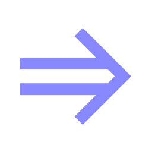

# Evnty

0-dependency, high-performance, reactive event handling library optimized for both browser and Node.js environments. This library introduces a robust and type-safe abstraction for handling events, reducing boilerplate and increasing code maintainability.

<div align="center">
  <a href="https://github.com/3axap4ehko/evnty">
    
  </a>
  <br>
  <br>

[![Coverage Status][codecov-image]][codecov-url]
[![Github Build Status][github-image]][github-url]
[![NPM version][npm-image]][npm-url]
[![Downloads][downloads-image]][npm-url]
[![Snyk][snyk-image]][snyk-url]

</div>

## Table of Contents

- [Motivation](#motivation)
- [Features](#features)
- [Platform Support](#platform-support)
- [Installing](#installing)
- [Documentation](https://3axap4ehko.github.io/evnty/)
- [Examples](#examples)
- [Migration](#migration)
- [License](#license)

## Motivation

In traditional event handling in TypeScript, events are often represented as strings, and there's no easy way to apply functional transformations like filtering or mapping directly on the event data. This approach lacks type safety, and chaining operations require additional boilerplate, making the code verbose and less maintainable.

The proposed library introduces a robust `Event` abstraction that encapsulates event data and provides a suite of functional methods like `map`, `filter`, `reduce`, `debounce`, etc., allowing for a more declarative and type-safe approach to event handling. This design facilitates method chaining and composition, making the code more readable and maintainable. For instance, it allows developers to create new events by transforming or filtering existing ones, thus promoting code reusability and modularity.

## Features

- Modern: Supports Promises and module systems ESM and CommonJS
- Zero Dependencies: Utilizes native features for optimal performance.
- Full TypeScript Support: Ensures type safety and improves developer experience.
- Functional Programming Techniques: Offers map, filter, reduce, expand, and more for event handling.
- Flexible Environment Support: Works seamlessly in both the browser and Node.js, including service workers.
- Performance Optimized: Competes with and exceeds other well-known libraries like EventEmitter3 and EventEmitter2 in performance benchmarks.

## Platform Support

| ![NodeJS][node-image] | ![Chrome][chrome-image] | ![Firefox][firefox-image] | ![Safari][safari-image] | ![Opera][opera-image] | ![Edge][edge-image] |
| --------------------- | ----------------------- | ------------------------- | ----------------------- | --------------------- | ------------------- |
| Latest ✔             | Latest ✔               | Latest ✔                 | Latest ✔               | Latest ✔             | Latest ✔           |

[node-image]: https://raw.github.com/alrra/browser-logos/main/src/node.js/node.js_48x48.png?1
[chrome-image]: https://raw.github.com/alrra/browser-logos/main/src/chrome/chrome_48x48.png?1
[firefox-image]: https://raw.github.com/alrra/browser-logos/main/src/firefox/firefox_48x48.png?1
[safari-image]: https://raw.github.com/alrra/browser-logos/main/src/safari/safari_48x48.png?1
[opera-image]: https://raw.github.com/alrra/browser-logos/main/src/opera/opera_48x48.png?1
[edge-image]: https://raw.github.com/alrra/browser-logos/main/src/edge/edge_48x48.png?1

## Installing

Using pnpm:

```bash
pnpm add evnty
```

Using yarn:

```bash
yarn add evnty
```

Using npm:

```bash
npm install evnty
```

## Examples

```js
import createEvent, { Event } from 'evnty';

// Creates a click event
type Click = { button: string };
const clickEvent = createEvent<Click>();
const handleClick = ({ button }: Click) => console.log('Clicked button is', button);
const unsubscribeClick = clickEvent.on(handleClick);

// Creates a key press event
type KeyPress = { key: string };
const keyPressEvent = createEvent<KeyPress>();
const handleKeyPress = ({ key }: KeyPress) => console.log('Key pressed', key);
const unsubscribeKeyPress = keyPressEvent.on(handleKeyPress);

// Merges click and key press events into input event
type Input = Click | KeyPress;
const handleInput = (input: Input) => console.log('Input', input);;
const inputEvent = Event.merge(clickEvent, keyPressEvent);
inputEvent.on(handleInput);

// Filters a click event to only include left-click events.
const handleLeftClick = () => console.log('Left button is clicked');
const leftClickEvent = clickEvent.filter(({ button }) => button === 'left');
leftClickEvent.on(handleLeftClick);

// Will press Enter after one second
setTimeout(keyPressEvent, 1000, { key: 'Enter' });
// Waits once the first Enter key press event occurs
await keyPressEvent.first(({ key }) => key === 'Enter').onceAsync();

keyPressEvent({ key: 'W' });
keyPressEvent({ key: 'A' });
keyPressEvent({ key: 'S' });
keyPressEvent({ key: 'D' });

clickEvent({ button: 'right' });
clickEvent({ button: 'left' });
clickEvent({ button: 'middle' });

// Unsubscribe click listener
unsubscribeClick();
// It does not log anything because of click listener is unsubscribed
leftClickEvent.off(handleLeftClick);

// Unsubscribe key press listener once first Esc key press occur
unsubscribeKeyPress.after(() => keyPressEvent
  .first(({ key }) => key === 'Esc')
  .onceAsync()
);
// Press Esc to unsubscribe key press listener
keyPressEvent({ key: 'Esc' });

const messageEvent = createEvent();
const messagesBatchEvent = messageEvent.debounce(100);

const messageEvent = createEvent();
const messagesBatchEvent = messageEvent.batch(100);

```

## License

License [MIT](./LICENSE)
Copyright (c) 2024 Ivan Zakharchanka

[npm-url]: https://www.npmjs.com/package/evnty
[downloads-image]: https://img.shields.io/npm/dw/evnty.svg?maxAge=43200
[npm-image]: https://img.shields.io/npm/v/evnty.svg?maxAge=43200
[github-url]: https://github.com/3axap4eHko/evnty/actions
[github-image]: https://github.com/3axap4eHko/evnty/workflows/Build%20Package/badge.svg?branch=master
[codecov-url]: https://codecov.io/gh/3axap4eHko/evnty
[codecov-image]: https://codecov.io/gh/3axap4eHko/evnty/branch/master/graph/badge.svg?maxAge=43200
[snyk-url]: https://snyk.io/test/npm/evnty/latest
[snyk-image]: https://snyk.io/test/github/3axap4eHko/evnty/badge.svg?maxAge=43200
